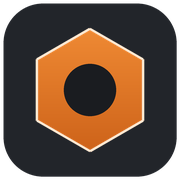
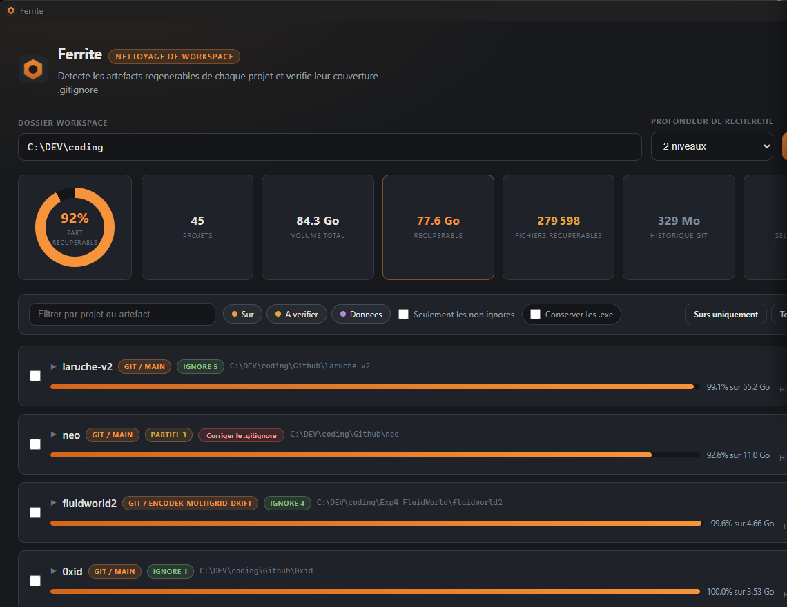

<h1 align="center">
  <br>
  Ferrite
</h1>

<p align="center">
  Find and remove the regenerable build artifacts scattered across a
  development workspace, and keep their <code>.gitignore</code> honest.
</p>

<p align="center">
  
  
  
  
  
</p>

<p align="center">
  
</p>

A desktop application. One executable, nothing to install: the local server,
the interface and the language catalogues are all embedded in the binary.

Point it at a workspace folder. It walks every project inside, measures what
each build artifact costs in bytes and files, tells you whether git is already
ignoring it, and lets you delete what you pick.

On the workspace this was built against, 45 projects, it reported 77.6 GB
reclaimable out of 84.3 GB in 5.8 seconds.

## Install

Grab `Ferrite.exe` from the [releases](https://github.com/infinition/ferrite/releases)
and run it. WebView2 ships with Windows 11 and recent Windows 10, so there is
no runtime to install.

Building from source:

```
make build            release build
make dist             build, verify, and place the binary in dist\
make                  list every task
```

Or directly:

```
cargo build --release --target x86_64-pc-windows-msvc
```

The MSVC target matters: `build.rs` locates the Windows SDK resource compiler
to embed the icon and version metadata. Without it the build still succeeds,
the executable just carries the default icon, which is why
`tools/verify_release.ps1` gates every build in CI.

```
Ferrite.exe                 desktop window, port 7420
Ferrite.exe --port 8080     different port
Ferrite.exe --headless      no window, interface served to the browser
```

The default port is kept while it is free. The interface stores your language,
last workspace and options in local storage, which is keyed by origin, so a
port that changed on every launch would wipe them.

## How the scan works

**Discovery.** Walks the workspace to the chosen depth, 1 to 6 levels, keeping
directories that carry a project marker: `.git`, `package.json`, `Cargo.toml`,
`pyproject.toml`, `go.mod`, `pom.xml`, `composer.json`, `mix.exs`, `*.sln`,
`*.uproject` and others. A directory recognised as a project is not searched
deeper.

**Detection.** 120 rules across 18 ecosystems. The walk stops descending as
soon as an artifact is recognised, which avoids double counting and makes the
scan fast.

**Sizing.** Bytes and file count, per artifact and per project.

**Git cross check.** `git check-ignore` resolves `.gitignore` coverage,
`git ls-files` finds what is already committed.

### Ambiguous names carry a constraint

`target` is Cargo in one project and Maven in another. `vendor` is Composer or
Go. `bin` is a .NET output directory or a folder of committed scripts. Those
rules only fire when the right marker file sits next to the candidate:

| Rule | Fires only when the parent holds |
|---|---|
| `target` as Cargo output | `Cargo.toml` |
| `target` as Maven output | `pom.xml` |
| `build` as Gradle output | `build.gradle` |
| `vendor` as Composer deps | `composer.json` |
| `vendor` as Go deps | `go.mod` |
| `bin` and `obj` | `*.csproj` or `*.sln` |
| `Library` and `Temp` as Unity | `Assets` and `ProjectSettings` |
| `_build` as Elixir | `mix.exs` |

There is deliberately **no rule on directories named `models` or
`checkpoints`**. In a Django or Rails application, `models/` holds source code.
Model weights are detected by file extension instead, which is precise and
cannot produce that false positive.

## Risk levels

| Level | Meaning | Examples |
|---|---|---|
| **Safe** | Pure build artifact, regenerated by a command | `node_modules`, `target`, `__pycache__`, `.next`, `venv`, `Pods`, `DerivedData` |
| **Review** | Usually generated, but may hold sources depending on the project | `dist`, `build`, `out`, Go `vendor`, `.idea`, `logs` |
| **Data** | Re-downloadable payload, the only loss is bandwidth | `*.safetensors`, `*.gguf`, `.cache/huggingface`, `wandb` |

Every row shows the command that regenerates the artifact.

## .gitignore coverage

The summary sits on the project header, readable without expanding anything,
with a count per state.

| State | Meaning |
|---|---|
| **Ignored** | Every occurrence is covered |
| **Partial** | Only some occurrences are covered |
| **Not ignored** | No occurrence is covered |
| **Already committed** | The paths are in the git index |
| **Not a repo** | The project is not a git repository |

**Already committed** exists because git never reports a tracked file as
ignored. On a repository that committed `node_modules`, adding the pattern
changes nothing until `git rm -r --cached` runs. Without a distinct state, the
fix button would look like it did nothing.

**Fix .gitignore**, shown on the headers that need it, appends the missing
patterns under a dated section without touching the rest of the file. Projects
that are not repositories are skipped and reported.

## Keeping your .exe files

The toolbar toggle changes how deletion works. Instead of erasing the tree,
Ferrite empties it file by file, leaving every `*.exe` in place along with only
the directories needed to reach them.

A cleaned `target/` therefore keeps its compiled binaries and loses everything
else. Measured on a test tree: 146 090 bytes removed, 3 executables preserved,
`target/debug/` and `target/release/` kept solely to hold them.

## Safety

- Deletion targets resolve only through the scan index, which maps
  `(project, rule, relative path)` to an absolute path. The client selects
  entries from that index and never supplies a path, so a forged request is
  inert.
- Paths outside the scanned workspace, the workspace root, project roots, and
  anything under `.git` are refused.
- Confirmation states the volume and the number of projects touched, with
  separate warnings for committed files and for data payloads.
- Deletion clears the read only attribute and handles long Windows paths
  through the `\\?\` prefix.

## Internationalisation

Every user facing string lives in `assets/locales/*.json`, served to the front
end by `/api/i18n/<lang>` and read by the backend through `i18n::t()`. French
and English ship in the box. Adding a language means dropping a file into
`assets/locales/` and declaring it in `src/i18n.rs`.

```
python tools/check_i18n.py
```

verifies that catalogues stay aligned, that each of the 120 rules has a
description in every language, and that no key referenced by the template or
the front end script is missing. It runs in CI and fails the build.

## Architecture

```
src/main.rs      tao window, wry webview, server startup
src/server.rs    state, scan jobs, HTTP routes
src/scanner.rs   traversal, sizing, git calls, deletion
src/catalog.rs   the 120 detection rules
src/report.rs    result shaping and the deletion index
src/i18n.rs      embedded language catalogues
assets/          index.html, style.css, app.js, locales, icons
tools/           icon generation, i18n coverage check
```

The window comes from `tao` and `wry`, the layer Tauri itself is built on, used
without the framework. That keeps a single executable and no JavaScript
toolchain. Rendering goes through WebView2.

Three dependencies: `tiny_http`, `serde_json`, and the `tao` plus `wry` pair.

## Contributing

See [CONTRIBUTING.md](CONTRIBUTING.md). Adding a detection rule is a one line
change in `src/catalog.rs` plus a description in each locale.

## License

MIT. See [LICENSE](LICENSE).
